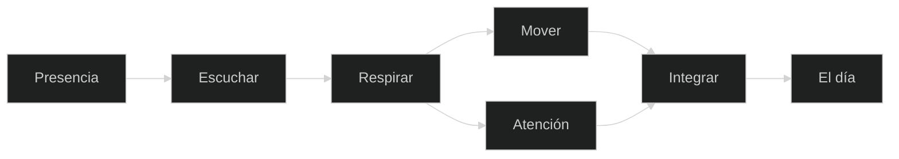

 

  

**Presencia · respiración · movimiento · atención**

Una práctica para volver a donde estás. Sin competir. Sin postureo.

### Living Sanctuary · 10 fases

Esta versión trata la web como un pequeño espacio de práctica, no como un portfolio estático.

| Fase | Decisión |
| --- | --- |
| 01 | Replantear la home como santuario digital |
| 02 | Dar al hero una respiración visual propia |
| 03 | Convertir Ritual en estados, no en navegación decorativa |
| 04 | Añadir **One Breath**, una micropráctica real |
| 05 | Hacer que presencia, cursor y scroll modulen el ambiente |
| 06 | Convertir la música en un órgano visual suave |
| 07 | Recordar intención y contexto sin perseguir al visitante |
| 08 | Crear **Quiet Mode** para apagar el ruido |
| 09 | Blindar accesibilidad, tamaño y sintaxis en CI |
| 10 | Documentar, publicar y proteger la experiencia |

La regla de diseño es sencilla: **la interfaz puede reaccionar, pero nunca debe exigir atención**.

### El ritual

La home no empieza pidiendo una clase. Empieza preguntando cómo llegas. El módulo interactivo **Ritual** permite elegir entre aterrizar, mover, afinar o compartir y convierte cada intención en una ruta distinta dentro de la práctica.

La idea es deliberada: el yoga no se presenta como una galería de posturas, sino como una experiencia de atención. La interfaz cambia de estado sin perder la calma, y el visitante decide cuánto quiere explorar.

`MURCIA · 2019—2026`

 

[Español](#español) · [English](#english)

---

### [Abrir el sitio](https://gracianb.github.io/yoga-instructor/)

Español e inglés. Claro y oscuro. Fraunces, Inter, JetBrains Mono.

## Español

Para mí el yoga no es la postura más difícil de la sala. Ni tocarte los pies. Ni parecer iluminado durante noventa minutos.

Es estar presente.

Movimiento, respiración, atención y escucha. El cuerpo trabaja. La mente baja el ruido. Cada persona encuentra su ritmo. La esterilla es donde empieza. No siempre donde termina.

Soy Gracián Baena. Me formé como instructor en Madrid en 2019. Al lado de la sala hay una trayectoria de atención al cliente, operaciones y formación. De ahí sale lo único que me parece imprescindible para enseñar: antes de dirigir a alguien, hay que escucharle. En una clase eso es observar, adaptar, guiar, y saber cuándo callarse.

| Principio | En la práctica |
| --- | --- |
| Presencia | Estar aquí, no ejecutar una lista |
| Respiración | La respiración consciente como atención |
| Movimiento | Control, movilidad, escucha |
| Atención | Bajar el ruido y mirar lo que pasa |
| Adaptación | Cada cuerpo, cada día, cada persona |
| Integración | Que algo de la práctica salga de la esterilla |

La práctica no tiene que impresionar a nadie. Tiene que servirte.

No es un catálogo de posturas. Es un juego de herramientas.

| | |
| --- | --- |
| Asana | Movimiento, estabilidad, movilidad. La postura es un medio, no el objetivo. |
| Pranayama | Respirar también es prestar atención. |
| Meditación | Quietud. No hace falta desaparecer. A veces basta con dejar de correr unos minutos. |
| Corporativo | Equipos. Moverse, respirar, pausar, recuperar la atención en la jornada. |
| 1:1 | La persona, su experiencia, su objetivo y el día que es hoy. |

Una clase no es una lista. Se observa, se escucha, se adapta, se guía, se respira, se mueve, se integra. El profesor guía. La persona practica. El cuerpo informa. La respiración acompaña. La atención lo junta.

### Dónde ha sido real

**Mood Fitness.** Abril de 2022 a junio de 2026. Sala y gimnasio, gente con niveles distintos. Un certificado no sustituye eso: mirar a personas de verdad. Cuándo explicar, cuándo demostrar, cuándo corregir, cuándo dejar espacio. Y cuándo dejar de hablar.

**Corporativo, en Majorel.** Programas de bienestar ligados a Google y YouTube. No se trataba de convertir una oficina en un ashram. Se trataba de un sitio accesible para moverse, respirar y volver al cuerpo en mitad del trabajo.

No quiero que alguien salga pensando en la postura. Prefiero que salga pensando: hoy he estado aquí. No hay una forma correcta. Hay una que tiene sentido para ti hoy. Puede ser intensa, suave, larga, corta, silenciosa, distinta cada día. El objetivo no es la foto del yoga. Es una relación más consciente con lo que te está pasando.

| | |
| --- | --- |
| Base | Murcia |
| Formación | Instructor · Madrid · 2019 |
| Sala | Mood Fitness · 2022—2026 |
| Corporativo | Bienestar en Majorel, ligado a Google / YouTube |
| Idiomas | Español, inglés, italiano, portugués, francés |

Yoga es la puerta 03. No compite con el deck ni con el lab. Los completa: allí hay sistemas, aquí hay alguien dentro.

| | |
| --- | --- |
| 01 | [Professional Deck](https://gracianb.github.io/professional-deck/) |
| 02 | [Systems Lab](https://gracianb.github.io/systems-lab/) |
| Hub | [GracianB](https://gracianb.github.io/GracianB/) |

<b>PDFs</b>

 

| | Español | English |
| --- | --- | --- |
| CV | [PDF](./assets/CV_Gracian_Baena_Yoga_ES.pdf) | [PDF](./assets/CV_Gracian_Baena_Yoga_EN.pdf) |
| Carta | [PDF](./Gracian_Baena_Carta_Yoga_ES.pdf) | [PDF](./Gracian_Baena_Cover_Letter_Yoga_EN.pdf) |

---

## English

For me yoga is not the hardest pose in the room. Not touching your toes. Not looking enlightened for ninety minutes.

It is being present.

Movement, breath, attention and listening. The body works. The mind gets quieter. Each person finds a pace. The mat is where it starts. Not always where it ends.

I am Gracián Baena. I trained as an instructor in Madrid in 2019. Beside the studio there is a career in customer-facing work, operations and training. That is where the only rule I trust comes from: before you guide someone, listen. In a class that means watch, adapt, guide, and know when to stop talking.

| Principle | In practice |
| --- | --- |
| Presence | Being here, not running a list |
| Breath | Conscious breathing as attention |
| Movement | Control, mobility, listening |
| Attention | Less noise. Notice what is happening |
| Adaptation | Every body, every day, every person |
| Integration | Some of the practice leaves the mat |

The practice does not have to impress anyone. It has to serve you.

It is not a catalogue of postures. It is a set of tools: asana as a means, not a destination; pranayama, because breathing is also attention; meditation as stillness, not disappearance; corporate sessions so a team can move, breathe and get their attention back; and 1:1, shaped to the person and to today.

A class is a path, not a list. Observe, listen, adapt, guide, breathe, move, integrate. The teacher guides. The person practices. The body reports. The breath stays with it. Attention ties it together.

### Where it was real

**Mood Fitness.** April 2022 to June 2026. Studio and gym, people at different levels. A certificate does not replace watching real people: when to explain, when to show, when to correct, when to leave space, and when to shut up.

**Corporate, at Majorel.** Wellness programs tied to Google and YouTube. Not an office turned into an ashram. An accessible place to move, breathe and come back to the body in the middle of a working day.

I do not want someone to leave thinking about the pose. I want them to leave thinking: I was here today. There is no single correct way. There is a way that makes sense for you today. Intense, gentle, long, short, quiet, different every day. The point is not a picture of yoga. It is a more conscious relationship with what is actually happening.

| | |
| --- | --- |
| Base | Murcia, Spain |
| Training | Instructor · Madrid · 2019 |
| Studio | Mood Fitness · 2022—2026 |
| Corporate | Wellness at Majorel, tied to Google / YouTube |
| Languages | Spanish, English, Italian, Portuguese, French |

This is door 03. It does not compete with the [deck](https://gracianb.github.io/professional-deck/) or the [lab](https://gracianb.github.io/systems-lab/). It completes them. The three meet at the [hub](https://gracianb.github.io/GracianB/).

---

### Hablemos

  

[Yoga](https://gracianb.github.io/yoga-instructor/) · [Hub](https://gracianb.github.io/GracianB/) · [Deck](https://gracianb.github.io/professional-deck/) · [Lab](https://gracianb.github.io/systems-lab/)

 

Murcia · 2026

